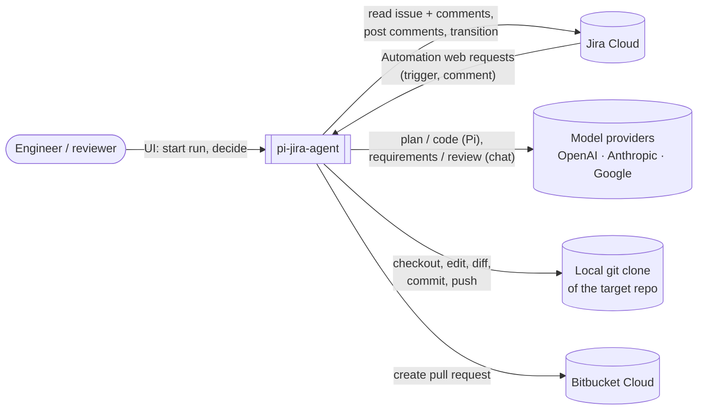
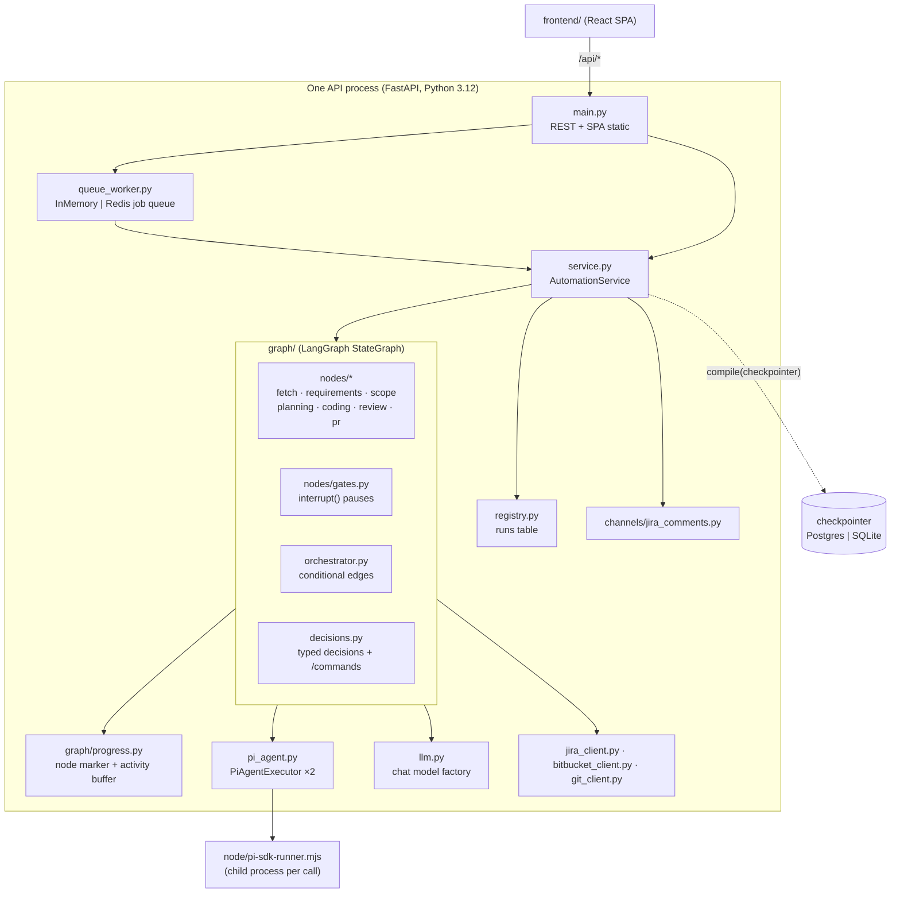
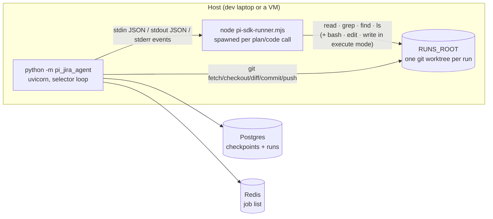
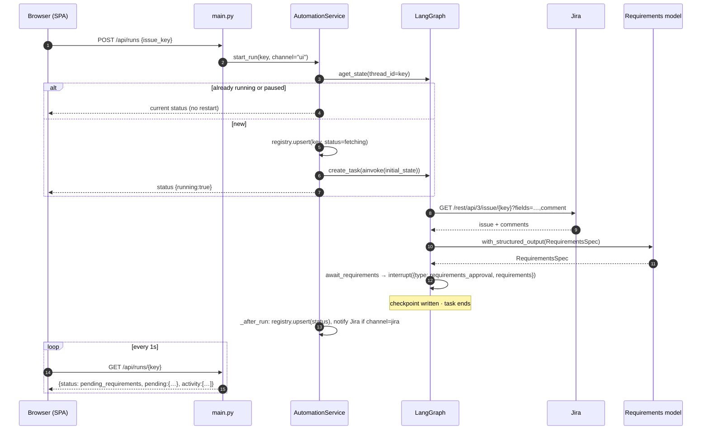
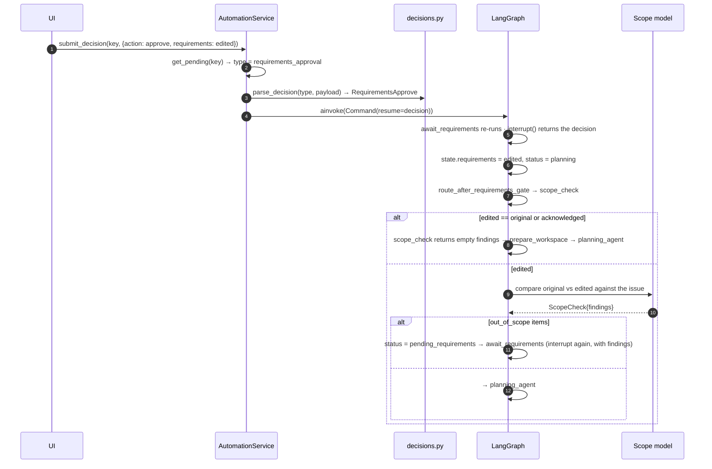
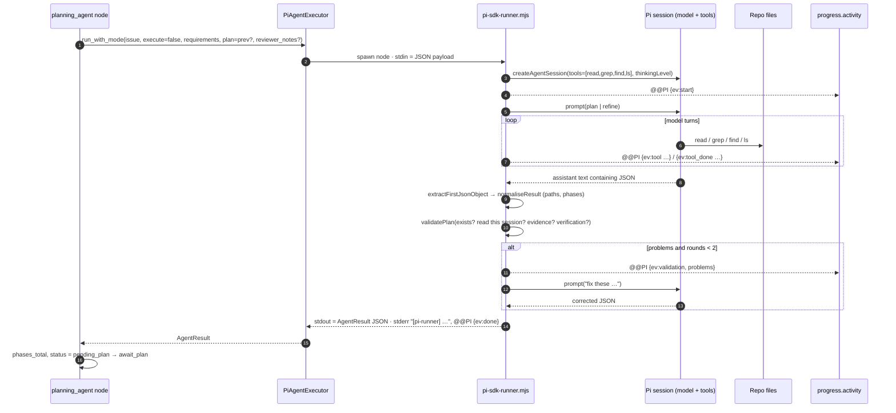
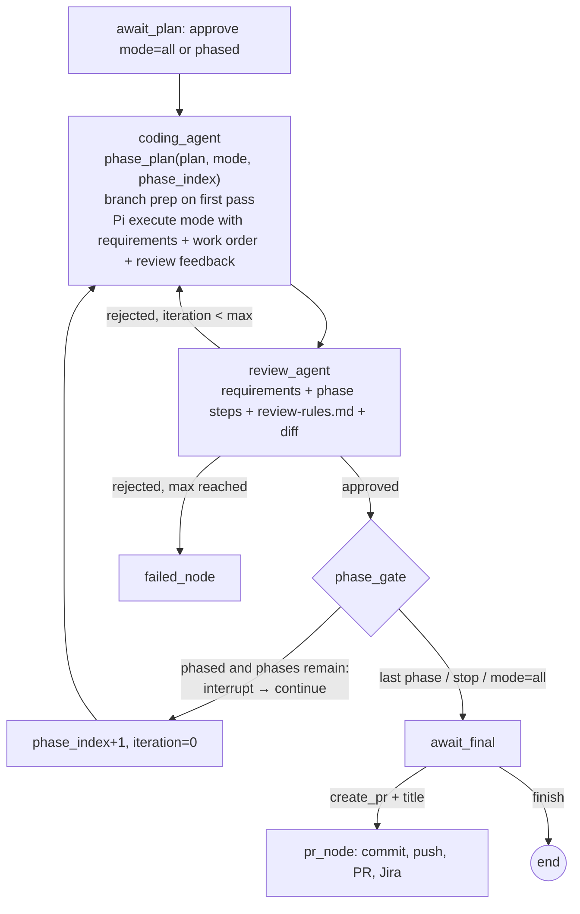
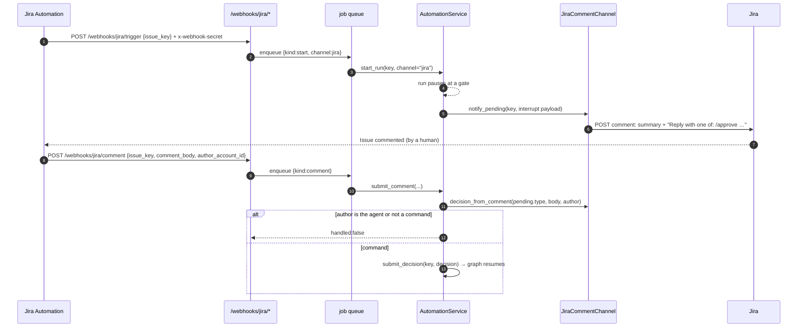

# Technical design

This is the single reference for how pi-jira-agent is built: what it is for, how the pieces fit, how a run flows through the code, where state lives, and what the boundaries and limits are. The shorter pages in this section ([Overview](overview), [Graph](graph), [State](state)) zoom into individual parts.

## 1. Purpose and scope

pi-jira-agent turns a Jira issue into a reviewed pull request while keeping a human in control at every stage. It is a **workflow orchestrator around AI agents**, not an agent harness itself: the coding harness (Pi) and the chat models do the reasoning; this system decides *when* they run, *what* they are given, *what they may touch*, and *who approves* the result.

Two delivery channels drive one workflow:

| Channel | Trigger | Feedback |
|---|---|---|
| **UI (flow 1)** | a person enters an issue key | screens with Approve / Revise / Reject |
| **Jira comments (flow 2)** | a label or assignment, via Jira Automation | the agent's Jira account posts a comment; humans reply with `/commands` |

Non-goals: replacing code review, multi-repository changes in one run, or running without a human decision at each gate.

## 2. System context



External dependencies and what each is trusted with:

- **Jira Cloud**: source of truth for the issue; in flow 2 also the feedback channel. Accessed with the agent's service-account token.
- **Model providers**: receive the issue text, the requirement, the plan, the diff, and file contents the agent reads. Nothing else.
- **Local git clone**: the only place code is modified. The coding agent has shell access inside it.
- **Bitbucket Cloud**: receives the pushed branch and the PR.

## 3. Component architecture



### Responsibilities

| Component | Owns | Does not own |
|---|---|---|
| `main.py` | HTTP surface, request validation, secret check, SPA serving, queue wiring | any workflow logic |
| `queue_worker.py` | buffering inbound triggers; one worker loop; Redis or memory backend | job semantics (delegated to a handler) |
| `service.py` | run lifecycle: start/resume, background task per issue, decision validation and resume, status projection, registry updates, flow-2 notifications | node behaviour |
| `graph/build.py` | constructing clients and executors, wiring nodes and edges, choosing the checkpointer | executing anything |
| `graph/nodes/*` | one stage each; pure functions of state plus injected clients | routing |
| `graph/nodes/gates.py` | the four human pauses; translating a validated decision into state updates | validating decisions |
| `graph/decisions.py` | the decision contract (pydantic models per gate), `/command` parsing for Jira | delivery |
| `graph/orchestrator.py` | the routing functions used by conditional edges | state mutation |
| `graph/progress.py` | in-memory "which node, since when" and the activity ring buffer | persistence |
| `pi_agent.py` | spawning the runner, streaming its events, parsing its result | prompts (those live in the runner) |
| `node/pi-sdk-runner.mjs` | everything Pi: session options, tool allowlist, prompts, plan validation, event stream | Jira, git, Bitbucket |
| `channels/jira_comments.py` | rendering a pending gate as a comment; mapping replies to decisions | when to notify (service decides) |
| `registry.py` | the `runs` table for listing | checkpoints |
| `models.py` | pydantic models shared by every layer, Jira ADF→text | behaviour |
| `config.py` | settings, per-stage model resolution, validation, public view | reading files other than review rules |

## 4. Runtime topology and deployment



- **Process model.** One uvicorn process. Each running issue is an asyncio task. Blocking work (the Node runner, git) runs in worker threads. The Node runner is a short-lived child process per call, killed on timeout.
- **Persistence.** `DATABASE_URL` set → `AsyncPostgresSaver` for checkpoints and a `runs` table for the registry; unset → SQLite file (`GRAPH_CHECKPOINT_DB`). `REDIS_URL` set → Redis list queue; unset → in-memory `asyncio.Queue`.
- **Windows note.** psycopg's async driver requires the selector event loop; `pi_jira_agent/eventloop.py` supplies it to uvicorn through `--loop pi_jira_agent.eventloop:loop_factory`, which `python -m pi_jira_agent` sets automatically.
- **Frontend.** Built once (`npm run build`) into `src/pi_jira_agent/static/dist` and served by FastAPI; `/assets/*` is resolved per request so a rebuild needs no restart. In development, Vite on `:5173` proxies `/api` to the backend.
- **Containers.** `docker compose up -d --build` runs the same topology as three services: `app` (Python + Node + git + the built SPA), `postgres` and `redis`. The target repository is bind-mounted at `/workspace/repo` rather than baked into the image, and compose overrides only the container-internal settings (paths, service hostnames) on top of the shared `.env`. See [Docker deployment](../operations/docker).
- **Scaling path.** With Postgres and Redis, several API/worker processes can share the queue and checkpoints. Each run has its own git worktree, so the remaining single-process limits are the in-memory task map and progress buffer (see §11).

## 5. Module map

```
src/pi_jira_agent/
├── __main__.py        entry point (uvicorn with the right event loop)
├── eventloop.py       selector loop factory for Windows
├── main.py            FastAPI app: /api/runs*, /api/config, /webhooks/jira/*, SPA
├── service.py         AutomationService: start_run, submit_decision, submit_comment, retry, get_status
├── queue_worker.py    InMemoryJobQueue, RedisJobQueue, make_job_queue
├── registry.py        SqliteRunRegistry, PostgresRunRegistry
├── config.py          Settings (pydantic-settings), stage_model(), validators, public_view()
├── models.py          JiraIssue/JiraComment, RequirementsSpec, ScopeCheck, PlanStep/PlanPhase, AgentResult, ADF→text
├── llm.py             make_chat_model(StageModelConfig)
├── pi_agent.py        PiAgentExecutor: payload, streaming subprocess, event forwarding
├── jira_client.py     get_issue (fields+comments), add_comment (ADF), transition_issue
├── bitbucket_client.py create_pull_request
├── git_client.py      worktrees, create_branch, has_changes, diff, commit_all, push_branch
├── workspace.py       RunWorkspaces: one worktree per run and repo under RUNS_ROOT
├── channels/jira_comments.py  render_pending, JiraCommentChannel
└── graph/
    ├── build.py       build_graph(), make_checkpointer(), make_serde(), make_pi_executor(stage)
    ├── state.py       GraphState TypedDict, Status literal
    ├── decisions.py   decision models, parse_decision, parse_comment_command, command_help
    ├── orchestrator.py route_after_* functions
    ├── progress.py    mark/get/clear, add_event/events, NODE_LABELS, STAGE_OF_NODE
    ├── slots.py       PiSlots: caps concurrent Pi sessions (MAX_CONCURRENT_RUNS)
    └── nodes/
        ├── fetch_issue.py       Jira fetch (or inline issue)
        ├── requirements_agent.py make_requirements_agent, make_scope_check
        ├── workspace.py         prepare_workspace: fetch, create the run's worktrees
        ├── planning_agent.py    Pi plan mode (first plan or refinement)
        ├── coding_agent.py      Pi execute mode per phase; phase_plan()
        ├── review_agent.py      structured verdict with review rules
        ├── gates.py             await_requirements, await_plan, phase_gate, make_await_final
        └── pr_node.py           commit, push, PR, Jira comment/transition
node/pi-sdk-runner.mjs   the Pi harness adapter (prompts, allowlist, validation, events)
frontend/src/            api.ts, pages/{Home,Run,Settings}, components/{Stepper,ActivityPanel,gates,DiffViewer,…}
tests/                   conftest fakes, test_workflow, test_api, test_decisions
scripts/demo_server.py   the API with every external faked
review-rules.md          reviewer must/should rules
docker-compose.yml       Postgres :5440, Redis :6390
```

## 6. Code flow

### 6.1 Starting a run and the requirements gate



The pause is a real stop: no Python coroutine is waiting. The next action, whenever it comes, resumes from the checkpoint.

### 6.2 Approving requirements with edits (scope check)



The UI renders findings as a warning with two exits: strip the flagged strings from every list and approve again, or approve with `acknowledge_scope: true`, which skips the check.

### 6.3 Planning in plan mode



Key guarantees enforced here, not by prompting alone:

- **No writes in plan mode.** The session's tool allowlist excludes `bash`, `edit`, `write`. This is Pi's `tools` option, so the model cannot call what does not exist.
- **No guessed paths.** Every `modify`/`delete` step must exist on disk *and* appear in the set of paths the agent opened with `read` in this session. `create` steps must not exist.
- **Refinement is incremental.** On refine, the previous plan and the reviewer's notes are in the prompt, `notes_response` is mandatory, and the agent re-reads only what it plans to touch (the read-set check still applies).

### 6.4 Coding, review and phases



`diffs` maps each selected repository to the cumulative diff of the run's worktree against the branch base (`git diff HEAD`), so the reviewer sees everything done so far in every repository; `phase_diffs` snapshots the whole map after each accepted phase. Nothing is committed before `pr_node`, which is what keeps those worktrees complete.

### 6.5 Flow 2: Jira comment round trip



The graph never knows which channel it is on except through `state.channel`, which the service uses to decide whether to post comments.

## 7. State and persistence model

### 7.1 Graph state (durable, per issue)

`GraphState` (`graph/state.py`) is a `TypedDict` fully serialised to a checkpoint after every node. Groups:

| Group | Fields |
|---|---|
| input | `issue_key`, `issue`, `channel`, `repos`, `base_shas` |
| requirements | `requirements_original`, `requirements`, `requirements_notes`, `scope_check`, `scope_acknowledged` |
| plan | `plan_result`, `plan_notes`, `execution_mode`, `phase_index`, `phases_total` |
| code/review | `code_result`, `diffs`, `phase_diffs`, `review_approved`, `review_feedback`, `iteration`, `max_iterations` |
| delivery | `pr_title`, `pr_urls` |
| bookkeeping | `status`, `current_node`, `retry_count`, `error` |

Pydantic objects inside the state (`JiraIssue`, `RequirementsSpec`, `AgentResult`, …) are serialised with LangGraph's `JsonPlusSerializer`; every such class is listed in `make_serde()`'s allow-list, which is what makes them deserialise on a different process after a restart.

### 7.2 Where each kind of state lives

| State | Store | Survives restart | Shared across processes |
|---|---|---|---|
| Graph state, pending interrupt, task error | checkpointer (Postgres / SQLite) | yes | yes with Postgres |
| Run list (key, summary, status, channel, timestamps) | `runs` table (same DB) | yes | yes with Postgres |
| Queued jobs | Redis list / asyncio.Queue | yes with Redis | yes with Redis |
| Running-task map, current node + start time, activity events | process memory (`service._tasks`, `graph/progress.py`) | no | no |
| Code changes | the run's git worktrees under `RUNS_ROOT` | yes, when `RUNS_ROOT` is on a volume | no: a worktree lives on one host |

Consequences: after a restart the UI can still show *where* a run is (from `current_node` and the pending interrupt) but not the live activity of a stage that was interrupted. A stage that was mid-flight when the process died shows as the next node to run with no error; `start_run` for that key auto-resumes it.

### 7.3 Status projection

`AutomationService.get_status` merges three sources into what the UI shows: checkpoint values (durable), the live progress marker (node, elapsed), and the pending interrupt (which also *overrides* `status`, because a gate's own state update is only stored when the gate returns). If the last task errored, the status becomes `stuck_error` with the message and the node to retry.

## 8. Decisions and channels

A **decision** is a pydantic model keyed by the pending interrupt `type` (`graph/decisions.py`):

```
requirements_approval : approve{requirements?, acknowledge_scope} | revise{notes} | cancel
plan_approval         : approve{mode: all|phased} | refine{notes} | reject
phase_gate            : continue | stop
final_review          : create_pr{pr_title, pr_description?} | finish
```

`parse_decision(pending_type, payload)` refuses any action not valid for that gate, so a stale UI cannot push a run into the wrong branch. The service also refuses `create_pr` when PR creation is disabled.

Channels only translate:

- **UI** sends the JSON body directly.
- **Jira** replies are parsed by `parse_comment_command` (`/approve phased`, `/revise <notes>`, `/pr <title>`, …); `command_help(type)` produces the schema the agent includes in each comment so humans never have to remember it.

## 9. The Pi runner protocol

The Node runner is the only place Pi is invoked. Its contract with Python:

**stdin** (one JSON object):

| Field | Meaning |
|---|---|
| `issue` | `JiraIssue` incl. comments |
| `requirements` | approved `RequirementsSpec` (both modes) |
| `executeChanges` | `false` → plan/refine mode, `true` → execute mode |
| `plan` | execute: the work order (whole plan or current phase); plan: the previous plan when refining |
| `reviewerNotes` | refine only |
| `reviewFeedback` | execute only, on a retry after rejection |
| `repoRoots` | every attached repository: `{name, path, properties}`. Empty means "just `repoCwd`" |
| `branchName`, `repoCwd`, `agentDir`, `model`, `provider`, `thinkingLevel`, `systemPrompt` | session setup; `repoCwd` is the primary repository |

**stdout**: exactly one JSON object, the `AgentResult` (`branch_name`, `commit_message`, `pr_title`, `pr_description`, `files_changed`, `analysis`, `plan_steps[]`, `verification[]`, `open_questions[]`, `notes_response`, `phases[]`). The runner normalises paths to POSIX form and drops a `phases` grouping that does not cover every step exactly once.

### 9.1 Attached repositories

Pi's tools resolve an absolute path exactly as given (`resolveToCwd` in the SDK): `cwd` is the base
for *relative* paths, not a boundary. Several checkouts therefore need no common parent and no
sandbox trickery — listing them in `repoRoots` is all it takes, which is the same idea as Claude
Code's `--add-dir`. `repoCwd` remains the primary repository because `bash` has a single working
directory.

Path handling inside the runner:

| Roots | `plan_steps[].repo` | `files_changed` | Tool calls |
|---|---|---|---|
| one | `""` | `path` | relative to the one clone |
| several | repository name | `repo-name/path` | absolute for anything outside the primary |

A single root keeps the previous behaviour byte for byte, so single-repo setups are unaffected.

`validatePlan` resolves each step against its repository before checking that the file exists and
was opened with `read`, and every path — in plan or execute mode — must resolve **inside one of the
roots**. In plan mode an offending path becomes a correction round; in execute mode the run fails.
That check is detection, not prevention: the tools accept any absolute path and this build of the
SDK ships no pre-tool hook, so the runner can only refuse to hand Python a result that touched
something nobody attached.

**stderr**: free text for humans, plus `@@PI {json}` lines that Python forwards to the activity buffer: `start`, `model_turn`, `tool`, `tool_done`, `assistant`, `validation`, `done`, `error`. Each carries `t`, seconds since the runner started.

**Modes and tools**:

| Mode | Tools | Prompt |
|---|---|---|
| plan | read, grep, find, ls | orient → locate → read fully → check tests/docs → decide → phases; hard rules on paths/evidence/verification |
| refine | same | previous plan + reviewer notes; answer in `notes_response`; complete revised plan |
| execute | read, bash, edit, write | implement the work order; re-read before editing; run verification with bash; no git commit/push/checkout |

**Timeout**: `PI_TIMEOUT_SECONDS` per call; Python kills the child and the node fails with a retryable error.

## 10. Configuration model

`Settings` (`config.py`) is loaded once from the environment and `.env`. Notable design choices:

- **Per-stage models** are resolved by `stage_model(stage)` with explicit fallbacks (`PLANNING_*`/`CODING_*` → `PI_*`; `REQUIREMENTS_*` → `REVIEW_*`). `build_graph` creates one `PiAgentExecutor` for planning and one for coding, so they can differ.
- **Validators fail fast**: malformed `DATABASE_URL`, `REDIS_URL`, `JIRA_BASE_URL` (must be the site root), or `PI_THINKING_LEVEL` abort startup with an actionable message rather than a distant stack trace.
- **Side-effect gates** are explicit booleans: `PR_CREATION_ENABLED` (alias `CREATE_PR`), `JIRA_COMMENTS_ENABLED`, `JIRA_COMMENT_CHANNEL_ENABLED`.
- **`public_view()`** feeds the Settings page and never includes keys or tokens.

## 11. Error handling, recovery and limits

| Situation | Behaviour |
|---|---|
| A node raises (Jira 404, model error, runner timeout, git failure) | LangGraph records the error on the checkpoint task; status shows `stuck_error`, the node, and the message. `POST /retry` resumes that node; if the reviewer was the failing node the error is folded into `review_feedback`. |
| Review keeps rejecting | up to `REVIEW_MAX_ITERATIONS` coding passes **per phase**, then `failed_node` (Jira comment if enabled). |
| Plan validation fails | up to two correction prompts in the same Pi session, then the node errors with the list of problems. |
| Duplicate trigger for a running or paused issue | `start_run` returns the current status; nothing restarts. |
| Process restart mid-stage | next `start_run` (e.g. a repeated webhook) auto-resumes from the checkpoint. |
| Wrong decision for the pending gate | HTTP 400 with the allowed actions. |

Known limits (by design, for now):

- **Worktrees are local to one host.** A run's uncommitted work lives in its worktree under `RUNS_ROOT`, so the worker that resumes a run must see the same directory. Run a single worker until the Postgres job queue (R-23) exists.
- **Activity is in-memory.** Live events are lost on restart; the durable record is the checkpoint.
- **Classic `/webhooks/jira`** accepts the full payload but does not verify Jira's HMAC signature; the Automation endpoints rely on the shared secret header.
- **Requirements editing from Jira** is limited to `/revise <notes>`.

## 12. Security model

- **Secrets** come only from the environment; the API never returns them; the runner receives the provider key via `PI_PROVIDER_API_KEY` in its environment, not on the command line.
- **Inbound auth**: every Jira ingress endpoint requires `x-webhook-secret`; project allow-listing (`ALLOWED_PROJECTS`) applies to all entry points. The UI has no authentication of its own and is intended to sit behind a network boundary or a reverse proxy that adds it.
- **Blast radius of the agents**: plan mode cannot write; execute mode can run shell commands and edit files. Pi does not sandbox its tools to `cwd` — absolute paths are resolved as given — so containment rests on the agent only being told about the repositories in `repos.json`, plus the runner's after-the-fact check that every reported path lies inside one of them (§9.1). Nothing is pushed or published without an explicit human `create_pr` decision. Jira comments are only posted when the corresponding flag is on.
- **Prompt injection surface**: issue text and comments are model input. The requirements gate is the mitigation: a human approves the framed requirement before any code is read or written, and the reviewer is told to reject unrequested changes.
- **Jira service account**: least-privilege project role; its own comments are ignored by account id so it cannot approve its own requests.

## 13. Testing strategy

| Layer | Where | What |
|---|---|---|
| Workflow | `tests/test_workflow.py` | full graph with fakes: scope warning loop, refine, phased execution, review retry, phase gate, PR creation, cancel/reject paths, exhaustion, gate validation, duplicate start |
| API | `tests/test_api.py` | start/status/decision over HTTP, config redaction, Jira ingress with secret, comment commands incl. self-comment ignore |
| Contracts | `tests/test_decisions.py` | decision validation, command parsing table, comment rendering |
| Persistence | same suites with `PI_TEST_DATABASE_URL` | exercises `AsyncPostgresSaver` + Postgres registry |
| Manual / UI | `scripts/demo_server.py` | the whole stack with fakes for clicking through the SPA |

The fakes (`tests/conftest.py::install_fakes`) replace the two chat models, the Pi executor, Jira, git and Bitbucket at the class boundary, so the graph, service, API and UI run unmodified.

## 14. Roadmap hooks

Places already shaped for the next steps:

- **Per-run git worktrees**: `GitBranchClient` is constructed once in `build_graph`; making it per-run (worktree path derived from the issue key) removes the shared-tree limit without touching nodes.
- **Structured requirement edits from Jira**: `RequirementsApprove.requirements` already accepts a full spec; a comment syntax or a Forge panel could supply it.
- **Signed webhooks**: `/webhooks/jira` can gain HMAC verification behind a `JIRA_WEBHOOK_SECRET`.
- **More channels**: anything that can turn text into the decision models (Slack, email) plugs in like `channels/jira_comments.py`.
