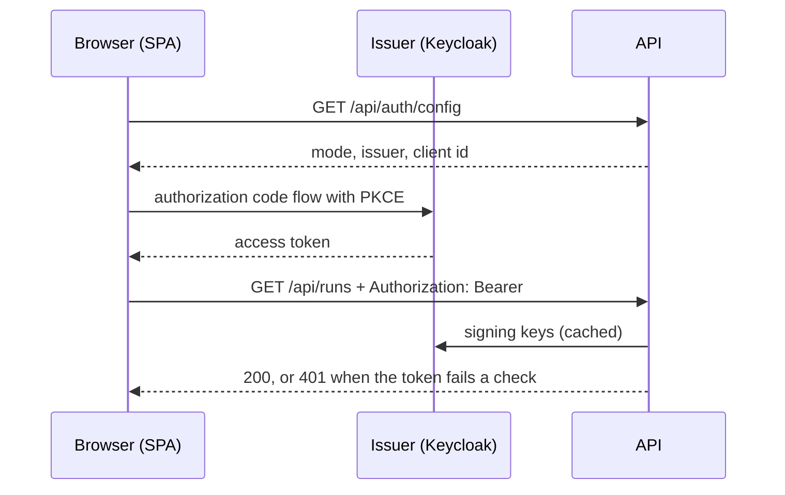

# Sign-in

The API accepts tokens from any OpenID Connect issuer. The compose file ships Keycloak as that
issuer for development and the pilot; pointing the same three settings at another issuer (Entra ID,
or a Keycloak that federates to it) needs no code change.

## What is protected

| Path | Who gets in |
|---|---|
| `/api/*` | a valid access token, on every request. Checked in one middleware, so a new route cannot be left open |
| `/api/auth/config` | open: the UI reads it before anyone is signed in. It returns the mode, issuer, client id and scope, nothing secret |
| `/health`, `/`, `/assets/*`, client-side routes | open: the page itself holds no data until it has a token |
| `/webhooks/*` | the shared `WEBHOOK_SECRET` header, compared in constant time. Jira Automation cannot sign in |

Any signed-in user may use every `/api` route: start runs, answer gates, retry. Roles come with
R-26. Who may answer a gate **from Jira** is a separate list, `GATE_APPROVERS`
(see [Jira webhooks](./webhook.md#who-may-answer)).

## The two modes

`AUTH_MODE` picks one.

- **`none`** (default): no sign-in. `python -m pi_jira_agent` binds to `127.0.0.1` by default and
  **refuses to start** with `AUTH_MODE=none` on any other address, so an unauthenticated API is never
  served to the network. This is the mode for local development and for the test suite.
- **`oidc`**: needs `OIDC_ISSUER`, `OIDC_CLIENT_ID` and `OIDC_AUDIENCE`; the server will not start
  without them.

The demo server (`scripts/demo_server.py`, the image's `demo` command) always runs without sign-in,
on whatever address it is given. Everything behind it is faked, so there is nothing to protect.

| Variable | Meaning |
|---|---|
| `AUTH_MODE` | `none` or `oidc` |
| `OIDC_ISSUER` | issuer URL, exactly as in the tokens' `iss` claim, and as browsers reach it |
| `OIDC_CLIENT_ID` | the public client the UI signs in with |
| `OIDC_AUDIENCE` | value the access token's `aud` claim must contain |
| `OIDC_SCOPE` | scopes the UI asks for (default `openid profile email`) |
| `OIDC_JWKS_URL` | where the server fetches signing keys. Empty = discovered from the issuer. Set it when the server reaches the issuer under another address than browsers do |

## How a request is checked

`auth.identify()` verifies the token's signature against the issuer's published keys, and its
issuer, audience, expiry and subject. Nothing is stored server-side, so any worker can answer any
request. A rejected token gets `401` with a generic message; the reason goes to the server log.

The UI (`frontend/src/auth.ts`) keeps tokens in `sessionStorage`, renews them silently, attaches
the access token to every API call, and sends the browser back to the issuer when the API answers
`401`. The signed-in person is recorded on each gate decision as `ui:<email>` in `decision_log`.

## Keycloak in compose

`docker compose up -d` starts Keycloak on `http://localhost:8081` and imports
`docker/keycloak/realm.json` on first start:

- realm `pi-jira-agent`
- public client `pi-jira-agent-ui`: authorization code flow, PKCE required, redirect URIs for
  `localhost:8090`, `:8000` and `:5173`
- an audience mapper that puts `pi-jira-agent-api` in the access token's `aud`

The export contains **no users and no secrets**; it is safe in a public repository and must stay
that way. Set `KEYCLOAK_ADMIN_PASSWORD` in `.env`, sign in to the admin console at
`http://localhost:8081` as `admin`, and create users in the `pi-jira-agent` realm.

The app container reaches Keycloak as `http://keycloak:8080`, while browsers use
`http://localhost:8081`. Tokens carry the browser's address as issuer, so compose sets
`OIDC_ISSUER` to that address and `OIDC_JWKS_URL` to the in-network one.

Keycloak here runs with `start-dev` (HTTP, embedded database in a volume). That is fine for a
laptop and a pilot behind a VPN. For anything else, run Keycloak in production mode behind TLS, or
point the three settings at an issuer your organisation already operates.

## Using another issuer

Register a public client with the authorization code flow and PKCE, add the UI's URL as redirect
URI, make sure access tokens carry an audience for this API, and set `OIDC_ISSUER`,
`OIDC_CLIENT_ID` and `OIDC_AUDIENCE`. To let people use their company login with the bundled
Keycloak instead, add the company directory as an identity provider in the realm.
